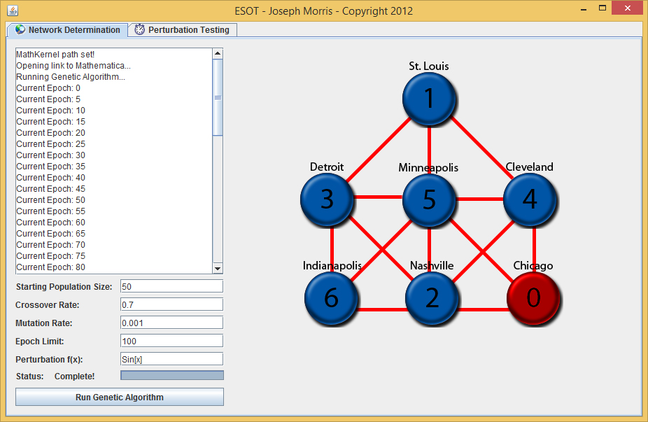

Name: Joseph Morris
Date: 03/08/2012

# Note:
This code has not been edited or maintained since it was written. It serves as an early example of my explorations in coding.

# Description:
This program uses a genetic algorithm to determine the most efficient network order of an energy grid for a given perturbation. Based on a problem given by an engineering professor at my university.
